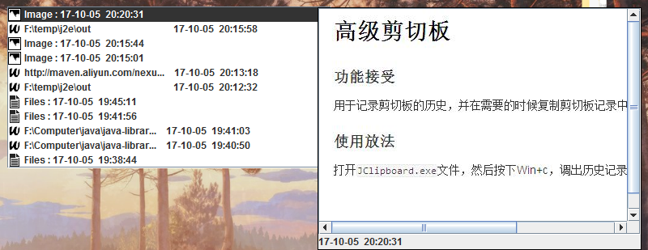

# 高级剪切板
### 功能接受
用于记录剪切板的历史，并在需要的时候复制剪切板记录中的内容

### 使用方法
打开`JClipboard.exe`文件，然后按下Win+c，调出历史记录窗口，应该是这个画风

之后用上下键或鼠标选取记录，选好时候按回车，复制记录里的内容。

另外，还可以用a键翻到上一页记录，d键翻到下一页记录，来选取更久远的内容.

### 安装方法
解压文件，即可运行

### 程序依赖
1. Java Runtime Environment（JRE）
2. Windows 7\8\10

### 获取方法
1. 精简版（需要另外安装JRE）
2. 完全版（自带JRE），解压即可